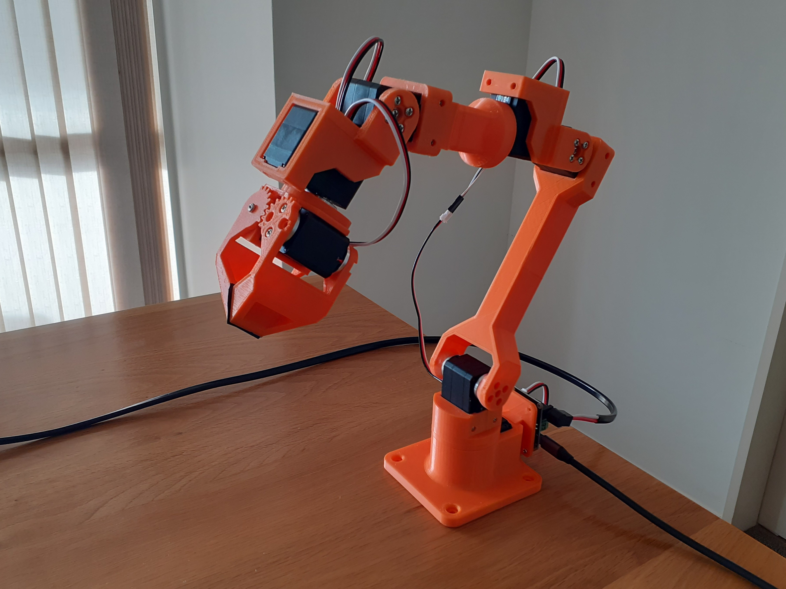

# Apto Arm

A 3D-printed 6-DoF robot arm for robotic manipulation experiments

## Hardware

#### Bill of Materials

| Part    | Amount  | Unit Cost ($US) | Link    |
| ------- | ------- | --------------- | ------- |
| Waveshare ST3215 Servo | 7 | $21.99 | [Waveshare](https://www.waveshare.com/product/robotics/motors-servos/st3215-servo.htm) |
| Waveshare Serial Bus Servo Driver Board | 1 | $4.99 | [Waveshare](https://www.waveshare.com/catalog/product/view/id/5832/s/bus-servo-adapter-a/category/446/) |

#### 3D Design

A CAD model of the robot arm is available on [Onshape](https://cad.onshape.com/documents/64b7b7fdd6760409a2b55df0/w/c815e893aebfc1d87f46ceb9/e/fe663a7fd6163cf9e7f510a0?renderMode=0&uiState=6876d94c4f00bb141856f4cd)

## Acknowledgement

Inspired by the [SO-ARM100](https://github.com/TheRobotStudio/SO-ARM100) and [MikataArm](https://github.com/ROBOTIS-JAPAN-GIT/open_manipulator/tree/dynamixel_6dof_mikata_arm) projects